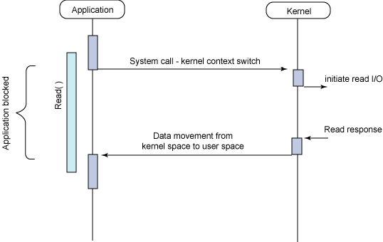

# 0 concept

# 0.1 Blocking vs Non-Blocking

# 0.2 Synchronous vs Asynchronous

# 1 Blocking I/O

# 2 Non-Blocking I/O

# 3 I/O Multiplexing (select, poll and epoll)

# 4 Signal Driven I/O (SIGIO)

# 5 Asynchronous I/O (POSIX aio_functions and Windows IOCP)

# Reference

The C10K Problem
> http://www.kegel.com/c10k.html  
> http://www.52im.net/thread-566-1-1.html

Select
> https://en.wikipedia.org/wiki/Select_(Unix)

Epoll
> https://en.wikipedia.org/wiki/Epoll

AIO(Asynchronous Input/Output)
> https://en.wikipedia.org/wiki/Asynchronous_I/O

IOCP(Input/Output Completion Port)
> https://en.wikipedia.org/wiki/Windows_NT_3.5  
> https://en.wikipedia.org/wiki/Input/output_completion_port  
> https://docs.microsoft.com/zh-cn/windows/win32/fileio/i-o-completion-ports

I/O Model Article
> http://www.52im.net/thread-1935-1-1.html  
> https://developer.ibm.com/articles/l-async/